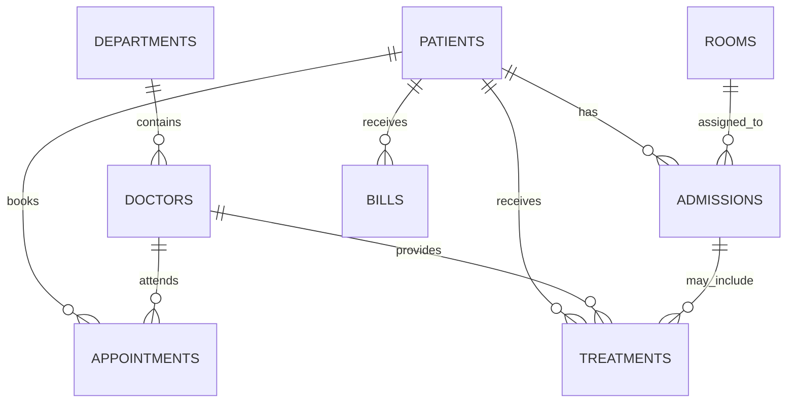

# HospitalCare: Project Explanation and Database Design

## Problem it solves

HospitalCare is a learning-focused hospital management web application. It replaces scattered paper records with a single MySQL database for patient registration, clinical staff, appointments, inpatient rooms, admissions, treatments, and billing. Its purpose is to demonstrate practical database design, safe data relationships, and a working PHP front end—not to handle real patient data in production.

## Main users and workflow

1. A staff member creates an account and signs in.
2. They register a patient using the Patient Management page.
3. They add a doctor under one department.
4. They schedule an appointment between that patient and doctor.
5. If necessary, they admit the patient to an available room.
6. They record a bill; MySQL calculates its final amount automatically.

This flow makes the database relationships visible through the application rather than only in SQL.

## Technology choices

| Layer | Technology | Why it was selected |
| --- | --- | --- |
| Front end | HTML, CSS, server-rendered PHP | Simple to understand, easy to run with XAMPP, and appropriate for a DBMS course. |
| Back end | PHP 8 with PDO | PDO prepared statements keep database calls readable and protect input values from SQL injection. |
| Database | MySQL / MariaDB | Runs directly in XAMPP and supports relational constraints, indexes, views/queries, and triggers. |
| Authentication | PHP sessions + password hashing | Passwords are stored as hashes, never as plain text. |
| Collaboration | GitHub + branches + pull requests | Keeps shared work reviewable and avoids teammates overwriting one another. |

## Data model

The most important design decision is that each entity has its own table. Patient details are not repeated in appointments, bills, or admissions. Instead, those tables store a `patient_id` foreign key. This prevents duplicate data and supports 3NF-style normalization.

| Table | Purpose | Key relationships |
| --- | --- | --- |
| `users` | Application accounts | Independent of clinical records. |
| `departments` | Hospital units such as Cardiology | One department has many doctors. |
| `doctors` | Clinical staff and consultation fee | Belongs to one department. |
| `patients` | Registered patient profiles | Parent record for appointments, admissions, treatments, and bills. |
| `appointments` | Doctor consultations | Links one patient to one doctor. |
| `rooms` | Capacity, rate, and availability | Used by admissions. |
| `admissions` | Inpatient stays | Links patient and room. |
| `treatments` | Diagnosis and medicines | Links patient, doctor, and optionally an admission. |
| `bills` | Charges and payment information | Links to one patient. |
| `appointment_log` | Audit history | Stores deleted appointment records automatically. |

## Database integrity and performance

The schema is designed to stop incorrect or inconsistent data at the database level:

- Primary keys uniquely identify every record.
- Foreign keys stop appointments from pointing to patients or doctors that do not exist.
- `NOT NULL`, `UNIQUE`, `CHECK`, and `ENUM` constraints restrict invalid values.
- Indexes on patient names, appointment dates, admission status, and bills make frequent lookups faster.
- Prepared statements are used throughout the PHP application for values supplied by users.

## Trigger demonstrations

The project includes three MySQL triggers required by the course scenario:

1. **Room availability trigger**: before an admission is saved, the trigger blocks an unavailable room. After a successful admission, it marks the room unavailable.
2. **Billing trigger**: before a bill is inserted or updated, MySQL sets `final_amount = total_charge + tax - discount`.
3. **Appointment audit trigger**: after an appointment is deleted, its original details and deletion timestamp are written to `appointment_log`.

These are useful demonstrations of automated business rules and audit trails in a relational database.

## Security notes

- Login passwords use PHP's `password_hash()` and `password_verify()`.
- Sign-in creates a session and pages require a valid session before showing hospital records.
- A local credentials file can be used for MySQL passwords and is excluded through `.gitignore`.
- This is an academic prototype. Do not upload real patient records or present it as a production healthcare system.

## Future improvements

- Add role-based permissions for receptionists, doctors, accountants, and administrators.
- Add treatment-management forms and prescription history.
- Add discharge processing that returns a room to `Available`.
- Add reporting pages for monthly revenue, appointment counts, and department performance.
- Add CSRF protection, form validation messages, automated tests, and a Docker setup for deployment beyond XAMPP.

## Portfolio talking points

When presenting the project, emphasize that it combines a normalized relational schema with a functional web interface. Explain one foreign-key relationship, one index, and one trigger live. Show the patient CRUD workflow and the automatic final bill calculation. These details demonstrate both database understanding and the ability to connect a front end to persistent data.
